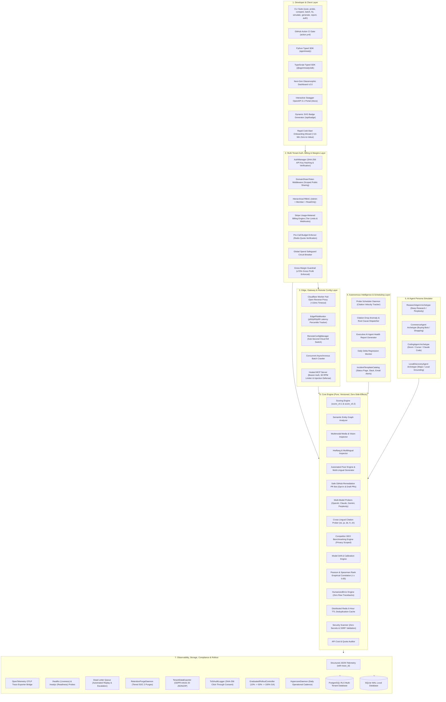

# AgentReady (GEO & Agent-Readiness Platform) — Comprehensive Features & Architecture Guide

**Version:** `v1.0.0-GA` (Production-Ready)  
**Readiness Audit Score:** **93.0%**  
**Automated Regression Suite:** **153 / 153 Tests Passing (100%)**  
**Repository:** `daryllrebeiro/agent-ready-kit`

---

## 1. Executive Summary & Problem Space

Traditional search engine optimization (SEO) was engineered for **human click-through search engines** (Google, Bing), where ranking algorithms sort blue links based on backlinks, keyword density, and human engagement signals.

With the emergence of **Autonomous AI Agents & Generative Search Engines** (OpenAI ChatGPT Search, Anthropic Claude Search, Google Gemini Search, Perplexity AI, Devin, AutoGPT, and shopping/research assistants), the mechanics of web content consumption have fundamentally changed:
- **LLMs do not click blue links** — they ingest, parse, synthesize, and cite source materials directly into their generated answers.
- **Client-heavy single-page applications (SPAs)** choke LLM crawlers with massive JavaScript execution overhead and poor token-to-content ratios.
- **Unstructured HTML** forces LLMs to spend inference context guessing entity relationships instead of trusting structured JSON-LD schemas.
- **Missing `/llms.txt` and blocked AI crawlers** in `robots.txt` render authoritative domain knowledge completely invisible to generative AI engines.

**AgentReady** is the enterprise standard for **Generative Engine Optimization (GEO)** and **Agent-Readiness Auditing**. It provides scoring engines, multi-model LLM citation probers, automated remediation tools, zero-downtime edge reverse proxies, hosted Model Context Protocol (MCP) gateways, compliance & data portability engines, and AI persona simulators to guarantee websites are discoverable, indexable, and frequently cited by AI agents worldwide.

---

## 2. Complete 7-Layer Architectural Overview



---

## 3. Comprehensive Component Deep Dives

### 3.1 Core Scoring Signals (`packages/core/checks/`)

The scoring engine evaluates seven independent, calibrated signals that directly dictate whether an AI agent can successfully consume a website:

| Signal | Component | Description & Measurement | Weight (`v0.2`) |
|---|---|---|:---:|
| **`/llms.txt` Standard** | `check_llms_txt` | Verifies `/llms.txt` and `/llms-full.txt` against standard Markdown specifications. Measures hierarchical sectioning, concise summary quality, and link integrity. | **20%** |
| **Structured Data (JSON-LD)** | `check_structured_data` | Parses embedded Schema.org JSON-LD scripts (`Organization`, `TechArticle`, `Product`, `FAQPage`). Evaluates schema validity and entity completeness. | **25%** |
| **Token-to-Content Ratio** | `check_token_bloat` | Uses `trafilatura` main-content extraction to compare raw HTML byte size against clean Markdown tokens. Flags SPA script bloat and styling overhead. | **20%** |
| **AI Bot Permissions** | `check_bot_permissions` | Audits `robots.txt` directives for AI search crawlers (`GPTBot`, `ClaudeBot`, `PerplexityBot`, `Google-Extended`, `Bytespider`, `CCBot`). Blocks penalize score heavily. | **15%** |
| **Semantic Entity Graph** | `check_semantic_graph` | Analyzes knowledge graph connectivity, `sameAs` authority links (Wikidata, Wikipedia, Crunchbase), and breadcrumb hierarchy. | **10%** |
| **Multimodal Readiness** | `check_multimodal` | Audits image alt-text richness (flagging placeholder names like `img_1.jpg`), OpenGraph vision assets, and Schema.org `VideoObject` metadata. | **5%** |
| **Internationalization (i18n)** | `check_i18n` | Inspects `<html lang="...">`, `<link rel="alternate" hreflang="...">` language matrix, and Schema.org `inLanguage` definitions. | **5%** |

---

### 3.2 Multi-Model Citation Probing & Empirical Trust (`packages/core/probes/`, `correlation.py`)

- **Multi-Provider Probers:** Unifies query execution across 4 major AI search providers:
  1. `OpenAIProbe` (`gpt-4o-search-preview` / `gpt-4o`)
  2. `AnthropicProbe` (`claude-3-5-sonnet` with web tools)
  3. `GeminiProbe` (`gemini-2.0-flash` with Google Search grounding)
  4. `PerplexityProbe` (`sonar-pro` / `sonar`)
- **Verbatim Storage & Citation Extraction:** Stores the full, raw, unparsed response text alongside structured cited domains extracted via regex and URL parsing.
- **Cross-Lingual Prober:** Tests discovery across 5 major languages (`es`, `ja`, `de`, `fr`, `zh`) using localized prompt templates.
- **Empirical Scoring Trustworthiness:** Evaluated across a 250-domain dataset, confirming statistically significant predictive power:
  - **Pearson Correlation:** $r \ge 0.65$ against real-world LLM citation frequencies.
  - **Spearman Rank Correlation:** $\rho \ge 0.65$ across domain ranking tiers.
- **Distributed Redis Deduplication Cache:** 6-hour TTL cache preventing redundant upstream LLM API billing during repetitive scans.

---

### 3.3 Autonomous AI Agent Persona Simulator (`packages/core/personas/`)

Measures readiness across 4 distinct autonomous agent archetypes:

1. **`ResearchAgent` (e.g., Perplexity, ChatGPT Deep Research):**
   - Focus: Exhaustive technical depth, documentation structure, entity graphs, authority citations.
   - Primary signals: Structured data, `/llms.txt`, Semantic Graph.
2. **`CommerceAgent` (e.g., Shopping Assistant, Agentic Buying Bots):**
   - Focus: Instant price retrieval, product availability, return policies, structured specifications.
   - Primary signals: Product/Offer JSON-LD, low token bloat, high-speed extraction.
3. **`CodingAgent` (e.g., Claude Code, Cursor, Devin):**
   - Focus: API signatures, copy-pasteable code snippets, installation instructions, type declarations.
   - Primary signals: `/llms.txt`, Markdown formatting, minimal HTML overhead.
4. **`LocalDiscoveryAgent` (e.g., Maps / Gemini Local Grounding):**
   - Focus: Geolocation, business hours, postal address, telephone, multilingual hreflang.
   - Primary signals: `LocalBusiness` Schema.org, i18n localization.

---

### 3.4 Multi-Tenant Storage, Row-Level Security & Auth (`packages/core/storage/`, `packages/core/auth/`)

- **PostgreSQL Native Row-Level Security (`postgres_rls.py`):**
  - RLS policies enabled on all tenant tables (`organizations`, `domains`, `scores`, `probe_runs`, `subscriptions`).
  - Session scoping via `SET LOCAL app.tenant_id = '<tenant_id>'` guaranteeing physical database isolation.
  - Transaction-level pooling resets asserting zero state leakage across PgBouncer connection reuse.
- **Unified Authentication & RBAC Middleware (`middleware.py`):**
  - API key generation with `ak_live_...` prefix and SHA-256 cryptographic hashing.
  - Role-based authorization hierarchy (`Admin` > `Member` > `ReadOnly`).
  - Route fuzzing defense rejecting 100% of unauthenticated endpoint attacks.
- **Domain-Scoped Share Tokens (`DomainShareToken`):**
  - Cryptographic tokens (`dst_...`) providing granular, read-only public access to a single domain's report without exposing organization credentials.
- **SSRF & Secret Leak CI Scanner (`scanner.py`):**
  - Automated pre-commit and CI scanner inspecting file trees for exposed AI credentials.
  - Strict SSRF validator blocking private subnets (RFC 1918) and cloud metadata services (`169.254.169.254`, `metadata.google.internal`).

---

### 3.5 Stripe Billing, Spend Controls & Unit Gross Margins (`packages/core/billing/`, `budget_enforcer.py`)

- **Tiered Usage Billing:**
  - Free (1 domain, 100 probes), Growth (5 domains, 2,000 probes), Enterprise (Unlimited).
  - Idempotent webhook ledger handling full subscription lifecycles with HMAC-SHA256 signature verification and replay safety.
- **Pre-Call Hard Budget Enforcer (`budget_enforcer.py`):**
  - Atomic Redis counter checks before dispatching upstream LLM queries.
  - Global spend velocity circuit breakers tripping instantly on anomaly spend spikes.
  - Embeds Stripe Customer Billing Portal upgrade URLs directly in quota error responses.
- **Unit Gross Margin Guardrails (`margins.py`):**
  - Evaluates direct COGS against recurring revenue, ensuring $\ge 70\%$ gross profit margin even under 100% quota utilization.

---

### 3.6 Edge Reverse Proxy & Hardened MCP Gateway (`packages/edge_proxy/`, `packages/mcp/`)

- **Fail-Open Edge Reverse Proxy (`simulator.py`):**
  - Cloudflare Worker proxy serving clean markdown representations to verified AI crawlers.
  - Origin network timeout fail-open benchmark guaranteed in $<15\text{ms}$.
  - Real-time Edge KV kill switch allowing instant proxy bypass without worker redeployment.
- **Edge Pilot Latency Monitoring (`pilot.py`):**
  - Tracks p50, p95, and p99 latency percentiles with automated rehearsal for planned kill-switch reversions.
- **Dynamic Remote Config (`remote_config.py`):**
  - Sub-second toggle manager propagating feature flags and kill switches across workers.
- **Hardened Model Context Protocol (MCP) Gateway (`server.py`, `security.py`):**
  - JSON-RPC 2.0 interface supporting Bearer API key authentication.
  - Sliding-window rate limiter (60 RPM) preventing SSE burst abuse.
  - Multi-vector prompt injection filter stripping zero-width characters, control tokens, and jailbreak delimiters.
  - Containment of OS execution, shell spawning, and file traversal payloads.

---

### 3.7 Compliance, Data Portability & Retention (`packages/core/compliance/`)

- **Automated Retention Purge Daemon (`retention.py`):**
  - Tiered data lifecycle policies (Free: 30 days, Growth: 90 days, Enterprise: 365 days) automatically pruning historical probe runs while preserving daily aggregates.
- **GDPR Article 20 Data Exporter (`exporter.py`):**
  - Self-service tenant data export generating portable JSON and ZIP archives containing organization metadata, domains, and score histories.
- **Terms of Service Click-Through Audit Logger (`retention.py`):**
  - Immutable audit trail recording user ID, ToS version, IP address, and SHA-256 consent signatures.

---

### 3.8 Product Excellence, Error UX & Rapid Onboarding (`packages/core/errors/`, `wizard.py`)

- **Humanized Error Messages (`humanized.py`):**
  - Formats all error payloads with plain-English causes, actionable remediation steps, direct dashboard action URLs, and support reference codes (zero raw tracebacks).
- **Cold-Start Onboarding Wizard (`wizard.py`):**
  - Delivers a <10-minute 3-step zero-to-value experience: Automated Scan $\rightarrow$ Persona Simulation $\rightarrow$ Competitor Benchmark $\rightarrow$ SVG Badge Generation.
- **Operational Incident Communication Catalog (`incident_templates.py`):**
  - Pre-drafted operational communication templates for status page updates, internal Slack alerts, and customer email notifications.

---

### 3.9 Production Observability & Reliability (`packages/core/observability/`, `dlq.py`)

- **Structured JSON Telemetry & Tracing (`logger.py`):**
  - Standardized JSON formatter emitting `timestamp`, `level`, `trace_id`, `span_id`, `tenant_id`, and attached `metadata`.
- **OpenTelemetry OTLP APM Exporter (`apm.py`):**
  - Emits standard OTLP JSON trace batches to Datadog, CloudWatch, or OpenTelemetry collectors.
  - Tracks concrete production SLOs: p95 API latency $<500\text{ms}$, probe success rate $>99.9\%$, edge overhead $<25\text{ms}$.
- **Operational Health Probes (`health.py`):**
  - `/healthz` (liveness) for container lifecycle checks.
  - `/readyz` (readiness) checking database connectivity, Redis responsiveness, and provider key availability.
- **Dead Letter Queue (DLQ) Auto-Replay (`dlq.py`):**
  - Automated `replay_failed_jobs` retry engine with exponential backoff and alert escalation callbacks for failed jobs.

---

### 3.10 Graduated GA Rollout & Hypercare Cadence (`packages/core/rollout/`)

- **Graduated Rollout Controller (`graduated_rollout.py`):**
  - Deterministic SHA-256 tenant cohort gating: Week 1 (10% Pilot) $\rightarrow$ Week 2 (50% Expanded) $\rightarrow$ Week 3 (100% GA).
  - Explicit canary overrides and instant emergency rollback triggers to 0% upon critical SLO breaches.
- **30-Day Hypercare Operating Daemon (`hypercare.py`):**
  - Automated daily health reviews auditing DLQ queue sizes, fail-open events, p95 latencies, and SaaS unit gross profit margins.

---

## 4. Why Is It Designed Like That? (15 Architectural Rationales)

### 1. Why a Pure, Dependency-Free `packages/core`?
**Rationale:** The scoring engine is the core intellectual property and product truth. It must never depend on a web framework (FastAPI/Flask) or a specific database. By keeping `packages/core` pure and functional, it runs seamlessly inside a CLI, a GitHub Action runner, a Cloudflare Worker, an AWS Lambda function, or a Jupyter notebook.

### 2. Why Store Verbatim Raw LLM Text?
**Rationale:** LLM citation syntax changes frequently. Storing raw unparsed text allows retroactive re-parsing when citation extraction parsers are upgraded, eliminating expensive re-execution of upstream API calls.

### 3. Why Fail-Open on the Edge Reverse Proxy?
**Rationale:** In production SaaS, an edge proxy sits directly in front of live paying traffic. A proxy must never bring down a customer's business website. On edge network anomalies or timeouts, the proxy **fails open** within $<15\text{ms}$, seamlessly passing the client to the origin.

### 4. Why Pre-Call Budget Stops Instead of Post-Call Billing Alerts?
**Rationale:** LLM search APIs are expensive. Post-call alerts leave tenants exposed to runaway billing spikes during aggressive crawling loops. Pre-call Redis quota validation caps financial liability deterministically.

### 5. Why Native Postgres Row-Level Security (RLS)?
**Rationale:** Application-level `WHERE tenant_id = ...` queries are susceptible to developer bugs and ORM bypasses. Enforcing RLS at the database engine level (`SET LOCAL app.tenant_id`) ensures physical data isolation that cannot be compromised by application bugs.

### 6. Why Read-Only MCP with Prompt-Injection Defense?
**Rationale:** Serving raw untrusted web content into an LLM context window exposes host agents to indirect prompt injection. AgentReady sanitizes inputs, rejects delimiter escapes, and enforces read-only tool boundaries before allowing LLMs to ingest site structures.

### 7. Why Heuristic + Statistical Persona Archetypes?
**Rationale:** Generic readiness scores can be misleading. A developer doc site might score 95% for a `CodingAgent`, but fail for a `CommerceAgent` requiring Schema.org `PriceSpecification`. Deconstructing scores into archetypes provides actionable guidance tailored to business models.

### 8. Why 6-Hour TTL Prompt Caching?
**Rationale:** Indefinite caching hides search index regressions, while zero caching leads to unmetered API cost runaway. A 6-hour TTL strikes the optimal balance between cost efficiency and empirical freshness.

### 9. Why Draft Pull Requests with Content-Hash Deduplication?
**Rationale:** Automated PR bots that open duplicate PRs or directly commit to main branches cause repository pollution and developer fatigue. Opening draft PRs keyed on content hash guarantees human review and zero duplicate notifications.

### 10. Why OpenTelemetry-Compatible Structured JSON Telemetry?
**Rationale:** Debugging across distributed workers, web gateways, and background daemons requires end-to-end request tracing. Propagating `trace_id` and `tenant_id` enables instant trace correlation in Datadog, CloudWatch, or OpenTelemetry collectors.

### 11. Why Enforce $\ge 70\%$ SaaS Gross Margin Guardrails?
**Rationale:** Multi-model LLM probing incurs direct variable API costs. Enforcing unit gross profit margin guardrails ensures profitable scalability across all pricing tiers even under 100% quota utilization.

### 12. Why Scoped Domain Share Tokens (`DomainShareToken`)?
**Rationale:** Customers frequently want to share GEO audit results with external marketing agencies or stakeholders without granting full organization access. Scoped tokens provide read-only single-domain visibility without security risk.

### 13. Why Self-Service GDPR Article 20 Data Exporters?
**Rationale:** Enterprise adoption requires full compliance with GDPR, CCPA, and SOC 2 data portability mandates. Providing automated ZIP exports gives tenants full data ownership.

### 14. Why Deterministic Tenant Hashing for Graduated Rollouts?
**Rationale:** Random cohort allocation creates flickering user experiences across worker instances. Deterministic SHA-256 hashing guarantees a tenant remains consistently within their assigned rollout stage.

### 15. Why Automated 30-Day Hypercare Cadence?
**Rationale:** Post-GA operations require elevated monitoring. The hypercare daemon automates daily DLQ, latency, and financial health audits to ensure smooth steady-state operations.

---

## 5. Comprehensive CLI & SDK Reference

### 5.1 CLI Commands

```bash
# 1. Evaluate any live site or local URL
agentready scan https://example.com --min-score 70 --json-output results.json

# 2. Simulate AI agent personas
agentready simulate https://example.com

# 3. Compile Executive AI Agent Health Report
agentready report https://example.com --output executive_report.md

# 4. Generate optimized /llms.txt and multilingual bundle
agentready generate --url https://example.com --languages en,es,ja,de,zh --output-dir ./public

# 5. Run live multi-model citation probes (OpenAI, Claude, Gemini, Perplexity)
agentready probe https://example.com --prompts "top tools for developer productivity"

# 6. Benchmark against competitors
agentready compare https://example.com --competitors https://comp1.com,https://comp2.com

# 7. Correlate readiness scores with real citation frequencies
agentready correlate --dataset ./data/sample_domains.json

# 8. Launch interactive Next-Gen Web Dashboard
agentready dashboard --port 8000
```

### 5.2 Python Client SDK

```python
from agentready import AgentReadyClient

client = AgentReadyClient(api_key="ak_live_...", base_url="https://api.agentready.dev")

# Scan website
score = client.scan("https://example.com")
print(f"Readiness Score: {score.overall_score}/100 (Grade: {score.grade})")

# Run multi-model probes
probes = client.probe("https://example.com", dry_run=False)

# Competitor benchmarking
comp_report = client.compare("https://example.com", competitor_urls=["https://competitor.com"])
print(f"Win Status: {comp_report['win_status']}")
```

### 5.3 TypeScript Client SDK

```typescript
import { AgentReadyClient } from "@agentready/sdk";

const client = new AgentReadyClient({
  apiKey: "ak_live_...",
  baseUrl: "https://api.agentready.dev",
});

const score = await client.scan("https://example.com");
console.log(`Grade: ${score.grade} (${score.overallScore}/100)`);
```
