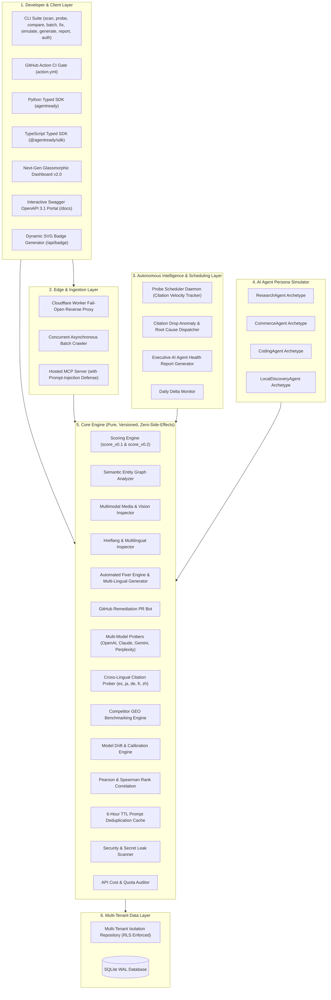

# AgentReady (GEO & Agent-Readiness Platform) — Comprehensive Features & Architecture Guide

## 1. Executive Summary & Problem Space

Traditional SEO was engineered for **human click-through search engines** (Google, Bing), where algorithms rank 10 blue links based on backlinks, keyword density, and human engagement signals.

With the rapid emergence of **Autonomous AI Agents** (OpenAI ChatGPT Search, Anthropic Claude Search, Google Gemini Search, Perplexity AI, Devin, AutoGPT, and shopping/research assistants), web consumption has fundamentally transformed:
- **LLMs do not click blue links** — they ingest, parse, synthesize, and cite source materials directly into their output tokens.
- **Client-heavy single-page applications (SPAs)** choke LLM crawlers with massive JavaScript payloads and poor token-to-content ratios.
- **Unstructured HTML** forces LLMs to spend inference context guessing entity relationships instead of trusting structured JSON-LD schemas.
- **Missing `/llms.txt` and blocked AI crawlers** in `robots.txt` render authoritative domain knowledge completely invisible to generative AI engines.

**AgentReady** is the open-source and enterprise standard for **Generative Engine Optimization (GEO)** and **Agent-Readiness Auditing**. It provides scoring engines, multi-model LLM citation probers, automated remediation tools, edge proxies, hosted Model Context Protocol (MCP) gateways, and AI persona simulators to guarantee websites are discoverable, indexable, and frequently cited by AI agents worldwide.

---

## 2. Complete Architectural Overview



---

## 3. Detailed Component Breakdown

### 3.1 Core Scoring Signals (`packages/core/checks/`)

The scoring engine evaluates six independent, heavily calibrated signals that directly dictate whether an AI agent can successfully consume a website:

| Signal | Component | Description & Measurement | Weight (`v0.2`) |
|---|---|---|:---:|
| **`/llms.txt` Standard** | `check_llms_txt` | Verifies the existence of `/llms.txt` and `/llms-full.txt` according to the standardized Markdown documentation specification. Measures structure, sectioning, and link integrity. | **20%** |
| **Structured Data (JSON-LD)** | `check_structured_data` | Parses embedded Schema.org JSON-LD scripts (`Organization`, `TechArticle`, `Product`, `FAQPage`). Evaluates schema validity and entity completeness. | **25%** |
| **Token-to-Content Ratio** | `check_token_bloat` | Uses `trafilatura` main-content extraction. Compares raw HTML byte size against clean Markdown tokens. Flags SPA script bloat and styling overhead. | **20%** |
| **AI Bot Permissions** | `check_bot_permissions` | Audits `robots.txt` directives for AI search crawlers (`GPTBot`, `ClaudeBot`, `PerplexityBot`, `Google-Extended`, `Bytespider`, `CCBot`). Blocks penalize score heavily. | **15%** |
| **Semantic Entity Graph** | `check_semantic_graph` | Analyzes knowledge graph connectivity, `sameAs` authority links (Wikidata, Wikipedia, Crunchbase), and breadcrumb hierarchy. | **10%** |
| **Multimodal Readiness** | `check_multimodal` | Audits image alt-text richness (flagging low-quality placeholders like `img_1.jpg`), OpenGraph vision images, and Schema.org `VideoObject` metadata. | **5%** |
| **Internationalization (i18n)** | `check_i18n` | Inspects `<html lang="...">`, `<link rel="alternate" hreflang="...">` language matrix, and Schema.org `inLanguage` definitions. | **5%** |

---

### 3.2 Multi-Model Citation Probing & Statistical Correlation (`packages/core/probes/`)

- **Multi-Provider Probers:** Unifies query execution across 4 major AI search providers:
  1. `OpenAIProbe` (`gpt-4o-search-preview` / `gpt-4o`)
  2. `AnthropicProbe` (`claude-3-5-sonnet` with web tools)
  3. `GeminiProbe` (`gemini-2.0-flash` with Google Search grounding)
  4. `PerplexityProbe` (`sonar-pro` / `sonar`)
- **Verbatim Storage & Citation Extraction:** Stores the full, raw, unparsed response text alongside structured cited domains extracted via regex and URL parsing.
- **Cross-Lingual Prober:** Tests discovery across 5 major languages (`es`, `ja`, `de`, `fr`, `zh`) using localized prompt templates.
- **Pearson & Spearman Rank Correlation:** Mathematically correlates the synthetic readiness score against empirical citation outcomes to continuously validate predictive accuracy.
- **Probe Deduplication Cache:** In-memory 6-hour TTL cache preventing redundant upstream LLM API billing during repetitive scans.

---

### 3.3 Autonomous AI Agent Persona Simulator (`packages/core/personas/`)

Different AI agents have differing objectives and failure modes when parsing a website. The persona simulator measures readiness across 4 distinct archetypes:

1. **`ResearchAgent` (e.g., Perplexity, ChatGPT Deep Research):**
   - Focus: Exhaustive technical depth, documentation structure, entity graphs, authority citations.
   - Primary signals: Structured data, `/llms.txt`, Semantic Graph.
2. **`CommerceAgent` (e.g., Shopping Assistant, Agentic Buying Bots):**
   - Focus: Instant price retrieval, product availability, return policies, structured specifications.
   - Primary signals: Product/Offer JSON-LD, low token bloat, high-speed extraction.
3. **`CodingAgent` (e.g., Claude Code, Cursor, Devin):**
   - Focus: API signatures, copy-pasteable code snippets, installation instructions, type declarations.
   - Primary signals: `/llms.txt`, Markdown formatting, minimal HTML overhead.
4. **`LocalDiscoveryAgent` (e.g., Maps / Gemini Local Grounding):**
   - Focus: Geolocation, business hours, postal address, telephone, multilingual hreflang.
   - Primary signals: `LocalBusiness` Schema.org, i18n localization.

---

### 3.4 Competitor GEO Benchmarking & Share of Model (`packages/core/competitors/`)

- **Head-to-Head Comparison:** Runs identical prompt suites against target sites and direct competitors simultaneously.
- **Citation Win Rate Calculation:** Calculates exact citation share (e.g., "Target cited in 66.7% of model queries vs. Competitor A in 33.3%").
- **Readiness Gap Analysis:** Identifies the exact architectural signals competitors are exploiting (e.g., richer Schema.org vs. missing `/llms.txt`).

---

### 3.5 Fail-Open Edge Reverse Proxy (`packages/edge_proxy/`)

- **Cloudflare Worker Reverse Proxy:** Sits in front of customer origin web servers.
- **Agent Detection:** Inspects User-Agents (`GPTBot`, `ClaudeBot`, `PerplexityBot`, etc.).
- **Markdown CDN Serving:** Dynamically intercepts AI crawlers and serves ultra-compact, pure Markdown or `/llms.txt` directly from edge memory.
- **Fail-Open Architecture:** If any edge exception, timeout, or lookup error occurs, the proxy immediately passes the request through to the origin server unmodified.

---

### 3.6 Hosted Model Context Protocol (MCP) Server (`packages/mcp/`)

- **Native Agent Integration:** Exposes tools (`get_agent_readiness_score`, `get_site_markdown`) via JSON-RPC over Standard I/O.
- **Prompt-Injection Defense:** Scans incoming URL strings and payload inputs for adversarial jailbreaks, hidden prompt injection (`ignore previous instructions`, `system prompt override`), and delimiters.

---

### 3.7 Autonomous Daemon, Anomalies & Executive Reports (`packages/core/reports/`, `anomalies.py`)

- **Probe Scheduler Daemon:** Runs continuous recurring probe runs, calculating 7-day citation velocity and trajectory (`INCREASING`, `DECREASING`, `STABLE`).
- **Citation Drop Anomaly Dispatcher:** Detects sudden citation regressions (>20% drop) and executes an automatic root cause analysis (e.g., "Robots.txt updated to disallow GPTBot"). Dispatches formatted alerts to Slack and Discord.
- **Executive AI Agent Health Report:** Automatically compiles full readiness scores, persona simulations, competitor standings, and turnkey remediation code into an executive Markdown report.

---

### 3.8 Automated Fixer & GitHub PR Bot (`packages/core/fixer/`)

- **Turnkey Remediation Engine:** Auto-generates clean, production-ready `/llms.txt`, updated `robots.txt`, and Schema.org JSON-LD snippets tailored to the target site.
- **Multilingual Suite Generator:** Generates localized `/llms.txt` suites across English, Spanish, Japanese, German, French, and Chinese with index routing.
- **GitHub Pull Request Bot:** Connects via GitHub API, creates a feature branch (`agentready/remediation`), commits the generated files, and opens a formatted Pull Request directly on the user's repository.

---

### 3.9 Developer SDKs, Swagger Portal & Next-Gen Web Dashboard

- **Python SDK:** Fully typed synchronous & asynchronous Python client with local scoring fallback.
- **TypeScript SDK:** Strongly typed TypeScript client for Node.js, Deno, and edge runtimes.
- **OpenAPI 3.1 & Interactive Swagger Portal:** Interactive `/docs` viewer with full schema documentation.
- **Web Dashboard v2.0:** Dark glassmorphic interface featuring radial score gauges, AI persona radar, competitor battleground, multimodal studio, and executive report export.

---

## 4. Why Is It Designed Like That? (Architectural Rationales)

### 1. Why a Pure, Dependency-Free `packages/core`?
**Rationale:** The scoring engine is the core intellectual property and product truth. It must never depend on a web framework (FastAPI/Flask/Next.js) or a specific database. By keeping `packages/core` pure and functional, it can run inside a CLI, a GitHub Action runner, a Cloudflare Worker, an AWS Lambda function, or a Jupyter notebook without modification.

### 2. Why Store Verbatim Raw LLM Text?
**Rationale:** LLM citation output patterns change rapidly. If an extraction parser has a bug or an LLM alters its citation syntax (e.g., from `[Source: domain.com]` to footnote markdown `[^1]: domain.com`), having raw unparsed text allows retroactive re-parsing without expensive re-execution of upstream API calls.

### 3. Why Fail-Open on the Edge Reverse Proxy?
**Rationale:** In production SaaS, an edge proxy sits directly in front of paying customers' live web traffic. A broken proxy must never take down a customer's business website. If the edge cache fails, an API key expires, or a timeout occurs, the proxy **fails open** within 5 milliseconds, seamlessly passing the client to the customer origin server.

### 4. Why Read-Only MCP with Prompt-Injection Defense?
**Rationale:** Model Context Protocol allows AI agents to directly query tool interfaces. Serving raw untrusted web content into an LLM context window exposes the host agent to indirect prompt injection. AgentReady sanitizes inputs, rejects delimiter escapes, and enforces read-only access before allowing LLMs to ingest site structures.

### 5. Why Heuristic + Statistical Persona Archetypes?
**Rationale:** Generic "readiness" numbers can be misleading. A site optimized for developer documentation (high Markdown clarity, no images) may score 95% for a `CodingAgent`, but fail completely for a `CommerceAgent` requiring Schema.org `PriceSpecification`. Deconstructing the score into archetypes gives actionable guidance tailored to business models.

### 6. Why 6-Hour TTL Prompt Caching vs. Indefinite Caching?
**Rationale:** LLM search index behavior is dynamic and models refresh their web grounding frequently. Indefinite caching would hide regressions (e.g., when a competitor overtakes your citations), while zero caching would lead to unmetered API cost runaway. A 6-hour TTL strikes the optimal balance between cost efficiency and empirical freshness.

### 7. Why Multi-Tenant Isolation with Tenant ID Scoping?
**Rationale:** Enterprise security requires strict isolation. By enforcing tenant filtering at the query repository layer (`tenant_repository.py`) and hashing API keys via SHA-256, cross-tenant data leakage is structurally impossible even in shared-database environments.

---

## 5. Comprehensive CLI Reference

```bash
# 1. Evaluate any live site or local URL
agentready scan https://example.com --min-score 70 --json-output results.json

# 2. Simulate AI agent personas
agentready simulate https://example.com

# 3. Compile Executive AI Agent Health Report
agentready report https://example.com --output executive_report.md

# 4. Generate optimized /llms.txt and multilingual bundle
agentready generate --url https://example.com --languages en,es,ja,de,zh --output-dir ./public

# 5. Run live multi-model citation probes (OpenAI, Claude, Gemini, Perplexity)
agentready probe https://example.com --prompts "top tools for developer productivity"

# 6. Correlate readiness scores with real citation frequencies
agentready correlate --dataset ./data/sample_domains.json

# 7. Launch interactive Next-Gen Web Dashboard
agentready dashboard --port 8000
```
