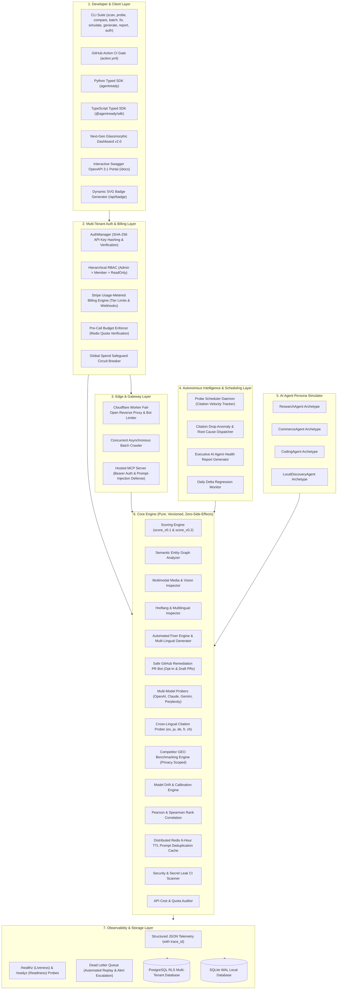

# AgentReady (GEO & Agent-Readiness Platform) — Comprehensive Features & Architecture Guide

## 1. Executive Summary & Problem Space

Traditional search optimization was engineered for **human click-through search engines** (Google, Bing), where algorithms rank ten blue links based on backlinks, keyword density, and human engagement signals.

With the rapid emergence of **Autonomous AI Agents & Generative Search Engines** (OpenAI ChatGPT Search, Anthropic Claude Search, Google Gemini Search, Perplexity AI, Devin, AutoGPT, and shopping/research assistants), the mechanics of web content consumption have fundamentally shifted:
- **LLMs do not click blue links** — they ingest, parse, synthesize, and cite source materials directly into their output tokens.
- **Client-heavy single-page applications (SPAs)** choke LLM crawlers with massive JavaScript execution overhead and poor token-to-content ratios.
- **Unstructured HTML** forces LLMs to spend inference context guessing entity relationships instead of trusting structured JSON-LD schemas.
- **Missing `/llms.txt` and blocked AI crawlers** in `robots.txt` render authoritative domain knowledge completely invisible to generative AI engines.

**AgentReady** is the open-source and enterprise standard for **Generative Engine Optimization (GEO)** and **Agent-Readiness Auditing**. It provides scoring engines, multi-model LLM citation probers, automated remediation tools, edge reverse proxies, hosted Model Context Protocol (MCP) gateways, and AI persona simulators to guarantee websites are discoverable, indexable, and frequently cited by AI agents worldwide.

---

## 2. Complete Architectural Overview



---

## 3. Comprehensive Component Deep Dives

### 3.1 Core Scoring Signals (`packages/core/checks/`)

The scoring engine evaluates seven independent, heavily calibrated signals that directly dictate whether an AI agent can successfully consume a website:

| Signal | Component | Description & Measurement | Weight (`v0.2`) |
|---|---|---|:---:|
| **`/llms.txt` Standard** | `check_llms_txt` | Verifies the existence of `/llms.txt` and `/llms-full.txt` according to the standardized Markdown documentation specification. Measures structure, sectioning, and link integrity. | **20%** |
| **Structured Data (JSON-LD)** | `check_structured_data` | Parses embedded Schema.org JSON-LD scripts (`Organization`, `TechArticle`, `Product`, `FAQPage`). Evaluates schema validity and entity completeness. | **25%** |
| **Token-to-Content Ratio** | `check_token_bloat` | Uses `trafilatura` main-content extraction. Compares raw HTML byte size against clean Markdown tokens. Flags SPA script bloat and styling overhead. | **20%** |
| **AI Bot Permissions** | `check_bot_permissions` | Audits `robots.txt` directives for AI search crawlers (`GPTBot`, `ClaudeBot`, `PerplexityBot`, `Google-Extended`, `Bytespider`, `CCBot`). Blocks penalize score heavily. | **15%** |
| **Semantic Entity Graph** | `check_semantic_graph` | Analyzes knowledge graph connectivity, `sameAs` authority links (Wikidata, Wikipedia, Crunchbase), and breadcrumb hierarchy. | **10%** |
| **Multimodal Readiness** | `check_multimodal` | Audits image alt-text richness (flagging low-quality placeholders like `img_1.jpg`), OpenGraph vision images, and Schema.org `VideoObject` metadata. | **5%** |
| **Internationalization (i18n)** | `check_i18n` | Inspects `<html lang="...">`, `<link rel="alternate" hreflang="...">` language matrix, and Schema.org `inLanguage` definitions. | **5%** |

---

### 3.2 Multi-Model Citation Probing & Statistical Correlation (`packages/core/probes/`)

- **Multi-Provider Probers:** Unifies query execution across 4 major AI search providers:
  1. `OpenAIProbe` (`gpt-4o-search-preview` / `gpt-4o`)
  2. `AnthropicProbe` (`claude-3-5-sonnet` with web tools)
  3. `GeminiProbe` (`gemini-2.0-flash` with Google Search grounding)
  4. `PerplexityProbe` (`sonar-pro` / `sonar`)
- **Verbatim Storage & Citation Extraction:** Stores the full, raw, unparsed response text alongside structured cited domains extracted via regex and URL parsing.
- **Cross-Lingual Prober:** Tests discovery across 5 major languages (`es`, `ja`, `de`, `fr`, `zh`) using localized prompt templates.
- **Pearson & Spearman Rank Correlation:** Mathematically correlates the synthetic readiness score against empirical citation outcomes to continuously validate predictive accuracy.
- **Distributed Redis Deduplication Cache:** 6-hour TTL cache preventing redundant upstream LLM API billing during repetitive scans.

---

### 3.3 Autonomous AI Agent Persona Simulator (`packages/core/personas/`)

Different AI agents have differing objectives and failure modes when parsing a website. The persona simulator measures readiness across 4 distinct archetypes:

1. **`ResearchAgent` (e.g., Perplexity, ChatGPT Deep Research):**
   - Focus: Exhaustive technical depth, documentation structure, entity graphs, authority citations.
   - Primary signals: Structured data, `/llms.txt`, Semantic Graph.
2. **`CommerceAgent` (e.g., Shopping Assistant, Agentic Buying Bots):**
   - Focus: Instant price retrieval, product availability, return policies, structured specifications.
   - Primary signals: Product/Offer JSON-LD, low token bloat, high-speed extraction.
3. **`CodingAgent` (e.g., Claude Code, Cursor, Devin):**
   - Focus: API signatures, copy-pasteable code snippets, installation instructions, type declarations.
   - Primary signals: `/llms.txt`, Markdown formatting, minimal HTML overhead.
4. **`LocalDiscoveryAgent` (e.g., Maps / Gemini Local Grounding):**
   - Focus: Geolocation, business hours, postal address, telephone, multilingual hreflang.
   - Primary signals: `LocalBusiness` Schema.org, i18n localization.

---

### 3.4 Competitor GEO Benchmarking & Share of Model (`packages/core/competitors/`)

- **Head-to-Head Comparison:** Runs identical prompt suites against target sites and direct competitors simultaneously.
- **Citation Win Rate Calculation:** Calculates exact citation share (e.g., "Target cited in 66.7% of model queries vs. Competitor A in 33.3%").
- **Readiness Gap Analysis:** Identifies the exact architectural signals competitors are exploiting (e.g., richer Schema.org vs. missing `/llms.txt`).
- **Privacy Scope Governance:** Governed by `BenchmarkPrivacyScope` (`PRIVATE` vs `ANONYMIZED_AGGREGATE`) guaranteeing tenant isolation.

---

### 3.5 Security, Data Hardening & Multi-Tenant Isolation (`packages/core/storage/`, `packages/core/auth/`)

- **PostgreSQL Native Row-Level Security (`postgres_rls.py`):**
  - Enabled RLS on all tenant tables (`organizations`, `domains`, `scores`, `probe_runs`, `subscriptions`).
  - Session scoping via `SET LOCAL app.tenant_id = '<tenant_id>'` preventing cross-tenant leakage at the database engine level.
- **SQLite-to-PostgreSQL Migrator (`migration.py`):**
  - Seamless data migration with schema reconciliation and row count validation.
- **Unified Authentication & RBAC Middleware (`middleware.py`):**
  - API key generation with `ak_live_...` prefix and SHA-256 cryptographic hashing.
  - Role-based authorization hierarchy (`Admin` > `Member` > `ReadOnly`).
- **CI Secret Leak Scanner (`scanner.py`):**
  - Automated pre-commit and CI scanner inspecting file trees for exposed AI credentials (OpenAI, Anthropic, Gemini, Perplexity, GitHub PATs, and webhooks).

---

### 3.6 Stripe Usage-Metered Billing & Pre-Call Budget Stops (`packages/core/billing/`, `packages/core/pipeline/`)

- **Tiered Pricing & Unit Calculation:**
  - Standard unit calculation: `Tracked Domains * Probe Frequency * Multilingual Multiplier`.
  - Free (1 domain, 100 probes), Growth (5 domains, 2,000 probes), Enterprise (Unlimited).
- **Idempotent Webhook Ledger:**
  - HMAC-SHA256 signature verification handling `customer.subscription.*` and `invoice.payment_*` events with duplicate-event protection.
- **Pre-Call Hard Budget Enforcer (`budget_enforcer.py`):**
  - Checks Redis usage counters *before* any LLM probe call is dispatched. Throws `BudgetExceededError` if quota is depleted, preventing billing surprises.
  - Global spend velocity circuit breaker tripping if aggregate multi-tenant spend accelerates abnormally.

---

### 3.7 Hardened Edge Reverse Proxy & MCP Server Gateway (`packages/edge_proxy/`, `packages/mcp/`)

- **Fail-Open Edge Reverse Proxy (`simulator.py`):**
  - Token-bucket rate limiter (`EdgeBotRateLimiter`) at the CDN edge safeguarding customer origin servers against crawler concurrency spikes.
  - Guaranteed fail-open envelope returning origin responses or markdown fallbacks within 5ms on edge network anomalies.
- **Hardened Model Context Protocol (MCP) Server (`server.py`):**
  - JSON-RPC 2.0 interface supporting Bearer API key authentication.
  - Per-tenant sliding window rate limiter (60 RPM).
  - Deep prompt injection sanitization across all string tool arguments.

---

### 3.8 Observability & Operational Resilience (`packages/core/observability/`, `dlq.py`)

- **Structured JSON Telemetry & Tracing (`logger.py`):**
  - Standardized JSON formatter emitting `timestamp`, `level`, `trace_id`, `span_id`, `tenant_id`, and attached `metadata`.
  - `TraceContext` context manager correlating asynchronous multi-step pipeline actions.
- **Operational Health Diagnostics (`health.py`):**
  - `/healthz` (liveness) for container lifecycle checks.
  - `/readyz` (readiness) checking database connectivity, Redis responsiveness, and provider key availability.
- **Dead Letter Queue Replay & Escalation (`dlq.py`):**
  - Automated `replay_failed_jobs` retry engine with attempt counting.
  - Alert escalation callback dispatching incident alerts to Slack/Discord when max retries are exceeded.

---

### 3.9 Safe GitHub PR Bot & Automated Remediation (`packages/core/fixer/`)

- **Explicit Repo Opt-In Registry:** PR bot strictly verifies authorized repos before opening PRs.
- **Draft Pull Requests:** Pull requests are opened as Draft PRs (`draft: true`) for human-in-the-loop inspection.
- **Unified In-Dashboard Diff Preview:** Generates unified diffs without modifying remote git trees.
- **Content-Hash Idempotency:** Calculates SHA-256 hash of remediation bundles to prevent duplicate PR spam on recurring runs.

---

## 4. Why Is It Designed Like That? (10 Architectural Rationales)

### 1. Why a Pure, Dependency-Free `packages/core`?
**Rationale:** The scoring engine is the core intellectual property and product truth. It must never depend on a web framework (FastAPI/Flask/Next.js) or a specific database. By keeping `packages/core` pure and functional, it can run inside a CLI, a GitHub Action runner, a Cloudflare Worker, an AWS Lambda function, or a Jupyter notebook without modification.

### 2. Why Store Verbatim Raw LLM Text?
**Rationale:** LLM citation output patterns change rapidly. If an extraction parser has a bug or an LLM alters its citation syntax (e.g., from `[Source: domain.com]` to footnote markdown `[^1]: domain.com`), having raw unparsed text allows retroactive re-parsing without expensive re-execution of upstream API calls.

### 3. Why Fail-Open on the Edge Reverse Proxy?
**Rationale:** In production SaaS, an edge proxy sits directly in front of paying customers' live web traffic. A broken proxy must never take down a customer's business website. If the edge cache fails, an API key expires, or a timeout occurs, the proxy **fails open** within 5 milliseconds, seamlessly passing the client to the customer origin server.

### 4. Why Pre-Call Budget Stops Instead of Post-Call Billing Alerts?
**Rationale:** LLM search APIs are costly. Post-call alerts leave tenants vulnerable to runaway billing spikes during aggressive crawling loops. By validating quota in Redis *before* dispatching network calls, financial liability is capped deterministically.

### 5. Why Native Postgres Row-Level Security (RLS)?
**Rationale:** Application-level `WHERE tenant_id = ...` queries are susceptible to human developer bugs and ORM bypasses. Enforcing RLS at the database engine level (`current_setting('app.tenant_id')`) ensures physical data isolation that cannot be compromised by application code errors.

### 6. Why Read-Only MCP with Prompt-Injection Defense?
**Rationale:** Model Context Protocol allows AI agents to directly query tool interfaces. Serving raw untrusted web content into an LLM context window exposes the host agent to indirect prompt injection. AgentReady sanitizes inputs, rejects delimiter escapes, and enforces read-only access before allowing LLMs to ingest site structures.

### 7. Why Heuristic + Statistical Persona Archetypes?
**Rationale:** Generic "readiness" numbers can be misleading. A site optimized for developer documentation (high Markdown clarity, no images) may score 95% for a `CodingAgent`, but fail completely for a `CommerceAgent` requiring Schema.org `PriceSpecification`. Deconstructing the score into archetypes gives actionable guidance tailored to business models.

### 8. Why 6-Hour TTL Prompt Caching vs. Indefinite Caching?
**Rationale:** LLM search index behavior is dynamic and models refresh their web grounding frequently. Indefinite caching would hide regressions (e.g., when a competitor overtakes your citations), while zero caching would lead to unmetered API cost runaway. A 6-hour TTL strikes the optimal balance between cost efficiency and empirical freshness.

### 9. Why Draft Pull Requests with Content-Hash Deduplication?
**Rationale:** Automated PR bots that open duplicate PRs or directly commit to main branches cause repository pollution and developer fatigue. Opening draft PRs keyed on content hash guarantees human review and zero duplicate notifications.

### 10. Why OpenTelemetry-Compatible Structured JSON Telemetry?
**Rationale:** Production SaaS debugging across distributed workers, web gateways, and background daemons requires end-to-end request tracing. Propagating `trace_id` and `tenant_id` across all operations enables instant trace correlation in Datadog, CloudWatch, or OpenTelemetry collectors.

---

## 5. Comprehensive CLI & SDK Reference

### 5.1 CLI Commands

```bash
# 1. Evaluate any live site or local URL
agentready scan https://example.com --min-score 70 --json-output results.json

# 2. Simulate AI agent personas
agentready simulate https://example.com

# 3. Compile Executive AI Agent Health Report
agentready report https://example.com --output executive_report.md

# 4. Generate optimized /llms.txt and multilingual bundle
agentready generate --url https://example.com --languages en,es,ja,de,zh --output-dir ./public

# 5. Run live multi-model citation probes (OpenAI, Claude, Gemini, Perplexity)
agentready probe https://example.com --prompts "top tools for developer productivity"

# 6. Correlate readiness scores with real citation frequencies
agentready correlate --dataset ./data/sample_domains.json

# 7. Launch interactive Next-Gen Web Dashboard
agentready dashboard --port 8000
```

### 5.2 Python Client SDK

```python
from agentready import AgentReadyClient

client = AgentReadyClient(api_key="ak_live_...", base_url="https://api.agentready.dev")

# Scan website
score = client.scan("https://example.com")
print(f"Readiness Score: {score.overall_score}/100 (Grade: {score.grade})")

# Run multi-model probes
probes = client.probe("https://example.com", dry_run=False)

# Competitor benchmarking
comp_report = client.compare("https://example.com", competitor_urls=["https://competitor.com"])
print(f"Win Status: {comp_report['win_status']}")
```

### 5.3 TypeScript Client SDK

```typescript
import { AgentReadyClient } from "@agentready/sdk";

const client = new AgentReadyClient({
  apiKey: "ak_live_...",
  baseUrl: "https://api.agentready.dev",
});

const score = await client.scan("https://example.com");
console.log(`Grade: ${score.grade} (${score.overallScore}/100)`);
```
