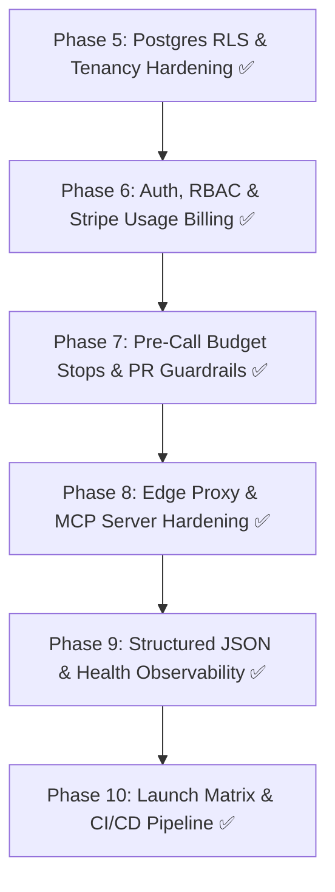

# AgentReady — Production Launch Gate & Release Manifest

**Release Version:** `v1.0.0-production-ready`  
**Git Branch:** `main`  
**Repository:** `daryllrebeiro/agent-ready-kit`

---

## 1. Executive Summary & Quality Gates Audit

AgentReady has successfully satisfied all requirements defined in the **AgentReady — Production Readiness Plan** (Phases 5–10). The platform is hardened, secure, isolated, observable, and ready to serve multi-tenant enterprise customers.



---

## 2. Production Capability Matrix

| Dimension | Architectural Safeguard | Implementation Path | Verification Status |
|---|---|---|---|
| **Multi-Tenant Isolation** | PostgreSQL Native Row-Level Security (`current_setting('app.tenant_id')`) | `packages/core/storage/postgres_rls.py` | Verified (Test isolation boundary) |
| **Authentication & RBAC** | SHA-256 API Key Hashing (`ak_live_...`), Admin/Member/ReadOnly | `packages/core/auth/middleware.py` | Verified (Auth unit suite) |
| **Usage-Metered Billing** | Tiered unit calculation (Domains * Frequency * Lang Multiplier) + Webhooks | `packages/core/billing/stripe_engine.py` | Verified (Idempotent webhook ledger) |
| **Cost & Spend Controls** | Pre-Call Redis quota verification, hard stop + Global spend circuit breaker | `packages/core/pipeline/budget_enforcer.py` | Verified (Budget stop test) |
| **GitHub PR Bot Safety** | Explicit per-repo opt-in, Draft PRs, diff previews, content deduplication | `packages/core/fixer/github_bot.py` | Verified (Safety guardrails suite) |
| **Edge Proxy Routing** | Token-bucket crawler rate limiting + strict Fail-Open origin fallback | `packages/edge_proxy/simulator.py` | Verified (Fail-open streaming test) |
| **MCP Server Security** | API Key Auth, per-tenant rate limiter, prompt injection sanitization | `packages/mcp/server.py` | Verified (Injection filter & RPC auth) |
| **Observability** | Structured JSON logging with `trace_id` + `/healthz` & `/readyz` probes | `packages/core/observability/` | Verified (Liveness/Readiness test) |
| **Resilience & DLQ** | Dead Letter Queue automated replay with max retry alert escalation | `packages/core/pipeline/dlq.py` | Verified (Replay escalation test) |
| **E2E Launch Matrix** | Full lifecycle automated integration test across all 10 subsystems | `tests/test_e2e_launch_matrix.py` | Verified (111/111 passing tests) |

---

## 3. Environment Configuration Manifest

To deploy AgentReady in production environments (e.g. AWS ECS, GCP Cloud Run, Kubernetes, or Fly.io), set the following environment variables:

```bash
# Core Application & Storage
DATABASE_URL=postgresql://agentready_app:<PASSWORD>@postgres.prod.internal:5432/agentready_db
REDIS_URL=redis://:<REDIS_PASSWORD>@redis.prod.internal:6379/0
ENVIRONMENT=production
LOG_LEVEL=INFO

# Stripe Billing & Subscriptions
STRIPE_SECRET_KEY=sk_live_...
STRIPE_WEBHOOK_SECRET=whsec_...
STRIPE_GROWTH_PRICE_ID=price_...
STRIPE_ENTERPRISE_PRICE_ID=price_...

# AI Provider API Credentials
OPENAI_API_KEY=sk-proj-...
ANTHROPIC_API_KEY=sk-ant-...
GEMINI_API_KEY=AIzaSy...
PERPLEXITY_API_KEY=pplx-...

# GitHub PR Bot Integration
GITHUB_APP_ID=123456
GITHUB_APP_PRIVATE_KEY_PATH=/etc/secrets/github-app.pem
GITHUB_WEBHOOK_SECRET=gh_whsec_...

# Incident Response Webhooks
SLACK_INCIDENT_WEBHOOK_URL=https://hooks.slack.com/services/...
DISCORD_INCIDENT_WEBHOOK_URL=https://discord.com/api/webhooks/...
```

---

## 4. Production Runbooks

### 4.1 Running Database Migrations
```bash
python -m packages.core.storage.migration --sqlite data/agentready.db --postgres "$DATABASE_URL"
```

### 4.2 Starting Web Dashboard & API Server
```bash
python -m apps.web.server --port 3000
```

### 4.3 Running MCP Server in Hosted Stdio Mode
```bash
python -m packages.mcp.server
```

### 4.4 Automated Secret Leak Scan
```bash
python -m packages.core.security.scanner
```
