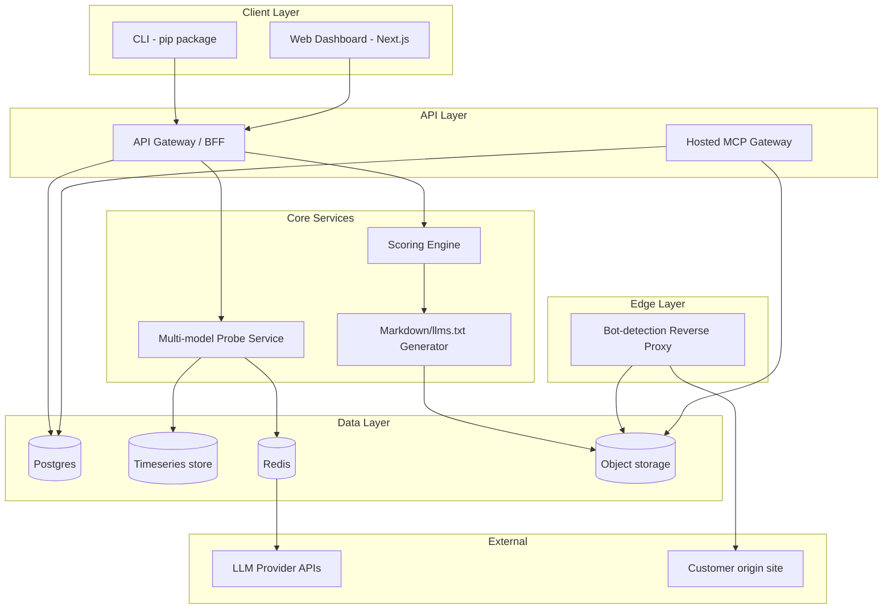
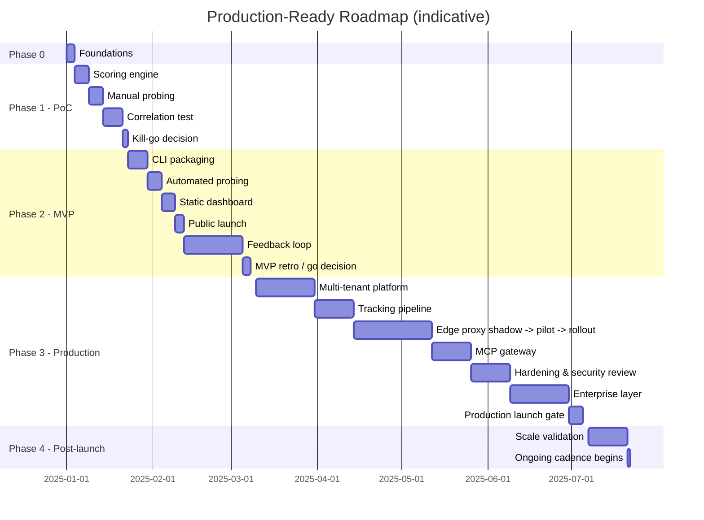

# Agent-SEO / GEO Platform — Production-Ready Architecture Plan (v2)

**Document type:** Detailed phase-based architecture & execution plan
**Audience:** Engineering team, technical stakeholders
**End goal:** A reliable, secure, multi-tenant SaaS product in production, serving paying customers
**Status:** Draft v2 — supersedes v1 with granular steps, testing strategy, deployment/rollback plans, and an explicit post-launch phase

---

## 1. How to read this document

Each phase is broken into **Steps**, each Step into **Sub-steps**. Every Step carries:

- **Definition of Done (DoD)** — a falsifiable bar, not a vibe
- **Testing strategy** — what gets tested and how, at that step
- **Rollback/kill plan** — what happens if this step reveals the plan was wrong
- **Dependencies** — what must exist before this step starts

This is intentionally heavier than v1. v1 answered "what are the phases." This answers "what does an engineer actually do, in what order, and how do we know each step is safe to build on."

---

## 2. Architecture Tenets (unchanged from v1, restated for reference)

1. Prove before you build — no infra investment ahead of validated need.
2. Boring technology first — cron beats Celery beats Kubernetes, until proven otherwise.
3. The scoring engine is the product — `packages/core` stays pure, versioned, and delivery-agnostic.
4. Multi-tenant and edge-proxy code is high-liability — hardened explicitly, never bundled into feature work.
5. Every step has a falsifiable exit criterion.
6. **(new)** Every production-facing step ships with its own rollback plan *before* it ships, not after an incident.
7. **(new)** No step is "done" until it has a test that would catch its regression.

---

## 3. End-State Architecture (reference target)

---

## 4. Phase 0 — Foundations

**Goal:** A repo and process skeleton that makes every later phase a swap, not a rewrite.

### Step 0.1 — Repo & tooling
- 0.1.1 Initialize monorepo (Turborepo or Nx) with `packages/core`, `packages/cli`, `apps/web` (stub), `apps/worker` (stub)
- 0.1.2 Python for `core`/`cli`; reserve TypeScript/Next.js for `apps/web` until Phase 2
- 0.1.3 Linting + formatting (ruff/black for Python, eslint/prettier reserved for web) enforced via pre-commit hook
- 0.1.4 CI: lint + unit test on every PR — no deploy pipeline yet

**DoD:** A new engineer can clone, install, and run `pytest` green in under 10 minutes.
**Testing:** CI itself is the test — a broken lint/test config fails the first PR.
**Rollback:** N/A (no production surface yet).

### Step 0.2 — Versioning & data contracts
- 0.2.1 Define `Score`, `ScoreComponent`, `ProbeResult` as Pydantic models in `packages/core/schemas.py` — this is the single most important artifact in Phase 0, since every later phase reads/writes these shapes
- 0.2.2 Establish semantic versioning for the scoring algorithm (`score_v0.1`), stored on every `Score` record
- 0.2.3 Write schema unit tests (serialization round-trip, required-field validation) before any scoring logic exists

**DoD:** Schemas merged, tested, and documented in `docs/schemas.md`.
**Testing:** Round-trip serialization tests; a bad-input fixture set that should fail validation.
**Rollback:** Schema changes after this point are additive-only (new optional fields) until a major version bump — breaking changes get a migration note.

### Step 0.3 — Secrets & environment
- 0.3.1 `.env.example` documenting required keys (OpenAI, Anthropic, Gemini, Perplexity)
- 0.3.2 No secrets manager yet — but document the future swap point (`docs/decisions/secrets-manager.md`, a one-line "revisit when: multiple engineers need shared secrets" note)

**DoD:** Any engineer can populate `.env` from the example and run the scorer locally.

---

## 5. Phase 1 — PoC: Validate the Core Hypothesis

**Goal:** Determine, with evidence, whether an agent-readiness score predicts LLM citation behavior.
**Non-goals:** auth, UI, deployment, packaging, multi-tenancy.

### Step 1.1 — Scoring engine
- 1.1.1 `check_llms_txt(url)` — fetch, parse against `llms.txt` spec, return `ScoreComponent` with evidence (what was found/missing)
- 1.1.2 `check_structured_data(html)` — extract JSON-LD, score against expected entity-type coverage
- 1.1.3 `check_token_bloat(html)` — extract main content (`trafilatura`), compute HTML-bytes : content-token ratio
- 1.1.4 `check_bot_permissions(robots_txt)` — parse allow/deny for `GPTBot`, `ClaudeBot`, `PerplexityBot`, `Google-Extended`
- 1.1.5 `aggregate(components, weights)` — weights externalized to a config file, not hardcoded
- 1.1.6 CLI-less runner script: `python -m core.scorer <url>` prints the `Score` JSON

**DoD:** Running the script against 5 known-good and 5 known-bad sites produces scores that a human would agree rank-order correctly by eye.
**Testing:** Unit tests per `check_*` function against fixture HTML/robots.txt files (including malformed input); no live network calls in unit tests — use recorded fixtures.
**Rollback/kill:** If sub-scores don't even pass the eyeball test on 10 known sites, stop and revisit signal definitions before scaling to Step 1.3.

### Step 1.2 — Manual probe run
- 1.2.1 Write 10–15 "best X for Y" prompts, chosen to span your target vertical(s)
- 1.2.2 Provider wrappers: `openai_probe`, `anthropic_probe`, `gemini_probe`, `perplexity_probe` — unified `ProbeResult` output
- 1.2.3 Store **raw response text verbatim**, alongside parsed `cited_domains[]` — never discard raw text after parsing
- 1.2.4 Manually spot-check ~20% of domain extractions for accuracy; log an extraction-accuracy estimate

**DoD:** A `ProbeResult` dataset exists for all prompts × all 4 providers, with a documented extraction-accuracy estimate.
**Testing:** Parsing logic unit-tested against a fixture set of realistic LLM response text (including edge cases: no citation, multiple citations, citation without URL).
**Rollback/kill:** If extraction accuracy is too low to trust (<~80% on spot check), fix parsing before proceeding — don't let a bad measurement instrument invalidate Step 1.3.

### Step 1.3 — Correlation test
- 1.3.1 Assemble a sample of 20–30 domains spanning "frequently cited" and "never cited" (seed this from Step 1.2's results plus manually sourced examples)
- 1.3.2 Run Step 1.1's scorer against all sampled domains
- 1.3.3 Analysis notebook: does score separate the two groups? Which sub-score correlates most strongly?
- 1.3.4 Export the full dataset (domains + scores + citation outcomes) as a checked-in fixture — this seeds Phase 2 test data and is a durable artifact regardless of outcome

**DoD:** A written finding with a chart/table, not just a gut read.
**Testing:** N/A (this step *is* the test).
**Rollback/kill:** This is the phase's kill gate — see Step 1.4.

### Step 1.4 — Kill/go decision
- 1.4.1 Written summary: correlation strength, which signals drove it, which didn't
- 1.4.2 If weak/no correlation: identify whether it's a measurement problem (fix and re-run 1.3) or a hypothesis problem (re-scope the product)
- 1.4.3 If validated: commit a re-calibrated `weights` config to `packages/core`, tag as `score_v0.2`

**DoD (phase exit criterion):** A go decision, backed by data, with a versioned, re-weighted scoring config ready for Phase 2.

---

## 6. Phase 2 — MVP: Real Users, Real Feedback

**Goal:** External users install and repeatedly use the tool; we learn what to build next; the CLI is a real acquisition channel.
**Non-goals:** billing, multi-tenant auth, worker queues, edge compute.

### Step 2.1 — CLI packaging
- 2.1.1 `packages/cli` as a thin wrapper over `packages/core` — argument parsing, terminal-formatted output, exit codes
- 2.1.2 `agentready scan <url>` and `agentready generate --sitemap <url>` commands
- 2.1.3 `--min-score` flag for CI usage (non-zero exit below threshold)
- 2.1.4 Publish to PyPI as `0.1.0`; semantic versioning starts here

**DoD:** `pip install agentready && agentready scan example.com` works on a clean machine (macOS/Linux/WSL) with no manual setup beyond an API key if using hosted features.
**Testing:** End-to-end CLI test in CI (install from built wheel, run against a fixture site or recorded HTTP fixtures — not live network calls in CI).
**Rollback:** Yank a bad PyPI release; keep `0.0.x` pre-releases for anything not yet stable.

### Step 2.2 — Automated probing (single instance)
- 2.2.1 Deploy `packages/core`'s prober behind a cron job on one small always-on instance (Fly.io/Railway/a $5 VM)
- 2.2.2 SQLite for storage — explicitly deferred Postgres migration, with the decision criteria written down (concurrent writes needed, or >~50k rows with complex queries)
- 2.2.3 Weekly run against opted-in domains only
- 2.2.4 Basic failure alerting (a failed cron run pages/emails you — even a simple healthcheck ping service is enough at this scale)

**DoD:** Two consecutive weekly runs complete successfully, unattended.
**Testing:** Cron job has a dry-run mode tested in CI; alerting path manually verified once (kill the job, confirm alert fires).
**Rollback:** Cron job is idempotent — a failed/partial run can be safely re-triggered manually without duplicate data.

### Step 2.3 — Static dashboard
- 2.3.1 Next.js app, statically generated (`getStaticProps`), nightly rebuild triggered after the cron job completes
- 2.3.2 No auth, no API routes — unlisted per-domain pages
- 2.3.3 Deploy to Vercel/Netlify free tier

**DoD:** A user can view their domain's score history and citation trend without any account.
**Testing:** Build-time test that the static generation script doesn't crash on empty/malformed data (a domain with zero probe history yet).
**Rollback:** Static hosting means a bad deploy is a one-click revert to the previous build — no migration risk.

### Step 2.4 — Public launch
- 2.4.1 GitHub repo public, README with methodology summary and link to full docs
- 2.4.2 Recruit 10–20 beta users directly (dev communities, IndieHackers, HN, relevant Slack/Discords)
- 2.4.3 Instrument: GitHub stars, PyPI downloads, CLI opt-in telemetry (score + domain only, explicit consent) — no third-party analytics SaaS needed yet

**DoD:** Launch executed; baseline metrics captured for comparison against Phase 3 growth.
**Testing:** N/A.
**Rollback:** N/A — but have a plan for responding to critical bug reports within 24–48h during launch week specifically (reputational risk is highest right after launch).

### Step 2.5 — Feedback loop
- 2.5.1 GitHub issues + a short structured survey (which signal matters most, trust in the score, willingness to pay for continuous tracking)
- 2.5.2 Weekly triage: map each piece of feedback to a specific Phase 3 component, or explicitly mark "not building this"
- 2.5.3 Maintain a public or semi-public roadmap so early users see their input reflected

**DoD:** A prioritized, evidence-backed list of which Phase 3 components are justified by real user signal (vs. assumed from the original spec).
**Testing:** N/A.

### Step 2.6 — MVP retro & Phase 3 go/no-go
- 2.6.1 Review: organic usage growth, retention (do users re-run the CLI / revisit the dashboard), and explicit demand signal for paid tracking
- 2.6.2 Decision: proceed to Phase 3, extend Phase 2 for more signal, or pivot

**DoD (phase exit criterion):** Documented go decision with supporting usage data.

---

## 7. Phase 3 — Production: Multi-Tenant SaaS

**Goal:** A reliable, secure, revenue-generating platform for paying customers, some of whose live production traffic depends on this system.

Sequenced by **risk**, not by feature list — lower-liability components (billing, auth) ship before the highest-liability one (edge proxy).

### Step 3.1 — Multi-tenant platform
- 3.1.1 Auth via managed provider (Clerk/Auth0/WorkOS) — do not build this in-house
- 3.1.2 Data model migration: SQLite → Postgres. Tables: `organizations`, `users`, `domains`, `scores` (versioned, time-series), `probe_runs`, `subscriptions`
- 3.1.3 Migration script + backfill from Phase 2's SQLite data, run against a staging copy first
- 3.1.4 Stripe billing integration, usage-metered on `domains tracked × probe frequency`
- 3.1.5 Tenant isolation tests: one org cannot read/write another org's data, enforced at the query layer (row-level security or equivalent), not just application logic

**DoD:** A new org can sign up, add a domain, get billed correctly for their tier, and cannot access another org's data — verified by an automated isolation test suite.
**Testing:** Isolation tests are the critical suite here — treat a failing tenant-isolation test as a release blocker, always.
**Rollback:** Staged migration — Phase 2's SQLite path stays read-only available during cutover; Postgres migration is reversible until DNS/traffic fully cuts over.

### Step 3.2 — Production tracking pipeline
- 3.2.1 Spike: Celery+Redis vs. a managed workflow engine (e.g., Temporal) — Temporal's built-in retry/backoff semantics fit "call 4 flaky external APIs on a schedule" well; decide before building, not after
- 3.2.2 Replace Phase 2's cron with the chosen orchestrator; `packages/core`'s prober logic is unchanged — only orchestration changes (this is the Phase 0 tenet #3 payoff)
- 3.2.3 Per-provider rate limiting: token bucket + circuit breaker per provider
- 3.2.4 Dead-letter queue for probes failing after retries; alert on DLQ growth, not on individual failures
- 3.2.5 Cost guardrails: per-tenant probe budget caps tied to their billing tier, enforced before the API call is made, not after

**DoD:** Pipeline survives a simulated single-provider outage (mock one provider returning 500s) without degrading other providers' throughput or double-billing the tenant.
**Testing:** Chaos test: kill one provider mid-run, confirm circuit breaker trips and DLQ captures failed jobs correctly.
**Rollback:** Orchestrator swap is behind a feature flag; can fall back to Phase 2's cron path for a subset of tenants if the new pipeline has issues at launch.

### Step 3.3 — Markdown CDN (edge proxy)

This is the highest-liability step in the whole plan — broken into finer sub-steps than any other, deliberately.

- 3.3.1 Build the Cloudflare Worker in **shadow mode first**: it logs what it *would* do (detected bot UA, cache hit/miss) without actually intercepting any traffic
- 3.3.2 Validate shadow-mode logs against real traffic for at least one full week before any live routing
- 3.3.3 Implement fail-open behavior explicitly: any error, timeout, or cache miss → pass through to origin unmodified. Write a test that forces every failure mode and asserts pass-through.
- 3.3.4 Enable live interception for **one willing, informed pilot customer** first — not a general rollout
- 3.3.5 Monitor: latency added, error rate, fail-open trigger rate, for at least one week on the pilot before expanding
- 3.3.6 Gradual rollout to remaining customers, tier by tier, with the ability to disable per-tenant instantly (a kill switch, not just a redeploy)
- 3.3.7 Cache invalidation wired to the generator (`packages/core`), on a customer-configurable schedule (default nightly; webhook-triggered on CMS publish for advanced tier)

**DoD:** Zero customer-reported outages attributable to the proxy during a 2-week pilot; fail-open path tested and verified in production, not just staging.
**Testing:** Forced-failure tests (kill the Worker's backend dependency mid-request) run in CI against a staging Worker; synthetic monitoring hitting the pilot customer's site continuously during rollout.
**Rollback:** Per-tenant kill switch is a requirement, not a nice-to-have — must exist before Step 3.3.4, not after an incident.

### Step 3.4 — Hosted MCP Gateway
- 3.4.1 Auto-generated per-tenant MCP server exposing site content from the same rendered Markdown store as 3.3
- 3.4.2 Auth: per-tenant scoped API keys/OAuth — treated identically to any customer-facing API from a security standpoint
- 3.4.3 Customer-defined API actions (agents *acting*, not just reading) scoped to a later sub-phase — ship read-only first
- 3.4.4 Security review specifically for prompt-injection risk: customer content flowing into an agent's context is a live attack surface (a malicious actor embedding instructions in content that gets served to an agent)

**DoD:** Read-only MCP gateway live for opted-in tenants, security review completed and documented, action-taking capability explicitly deferred.
**Testing:** Adversarial test set — attempt prompt injection via crafted page content, confirm the gateway doesn't leak cross-tenant data or execute unintended actions.
**Rollback:** Per-tenant opt-in, same kill-switch pattern as 3.3.

### Step 3.5 — Reliability & security hardening
- 3.5.1 APM/observability (Datadog/Honeycomb or equivalent) across all services, with edge-proxy-specific dashboards (latency, error rate, fail-open rate) as first-class views
- 3.5.2 On-call rotation and runbook, written and rehearsed (a tabletop incident walkthrough) before the first paying customer goes live on the edge proxy
- 3.5.3 Full security review: auth flows, tenant isolation, MCP attack surface, secrets management — external review if budget allows, given this product sits in front of production traffic
- 3.5.4 SOC2-track kickoff if enterprise customers are a near-term target (this is a months-long process — start the clock early, don't block launch on it)

**DoD:** Runbook exists and has been rehearsed; on-call rotation staffed; no open critical/high security findings.
**Testing:** Tabletop incident simulation (e.g., "the edge proxy is fail-closing for a customer") run end-to-end with the on-call engineer.
**Rollback:** N/A — this step *is* the rollback/reliability infrastructure for everything else.

### Step 3.6 — Enterprise layer
- 3.6.1 Roles/permissions within an org (admin/member/read-only)
- 3.6.2 SSO for enterprise tier
- 3.6.3 Integrations: Slack alerts on citation drops, Zapier
- 3.6.4 Sequence entirely based on actual sales conversations — do not build speculatively

**DoD:** Each item ships against a named customer commitment, not a guess.

### Step 3.7 — Production launch gate

Before calling Phase 3 "done" / GA:

- [ ] Tenant isolation test suite passing, run on every deploy
- [ ] Edge proxy fail-open verified in production under forced failure
- [ ] Per-tenant kill switches functional for both the proxy and MCP gateway
- [ ] On-call rotation staffed, runbook rehearsed
- [ ] Billing verified against at least one full customer lifecycle (signup → usage → invoice → upgrade/downgrade)
- [ ] Security review complete, no open critical/high findings
- [ ] Rollback tested for the riskiest deploy path (edge proxy config change) — not just described, actually executed once in staging

---

## 8. Phase 4 — Post-Launch: Scale & Continuous Hardening

Not in the original scope, but a "prod-ready system" isn't done at GA — it's ready when it survives growth. Named here so it's planned, not improvised.

### Step 4.1 — Scale validation
- 4.1.1 Load test the tracking pipeline at 10x current tenant count (synthetic tenants, not production)
- 4.1.2 Load test the edge proxy at realistic peak traffic multiples for your largest customer
- 4.1.3 Identify and document the next bottleneck *before* it's hit in production (e.g., "Postgres connection pool exhausts at ~X concurrent tenants — plan pgbouncer or read replicas at that point")

### Step 4.2 — Cost optimization
- 4.2.1 LLM probe cost is the dominant variable cost — audit per-tenant probe spend vs. their billing tier monthly, ensure margin holds as usage scales
- 4.2.2 Evaluate caching/deduplication of probe prompts across tenants in the same vertical where appropriate (careful: this can bias "share of model" accuracy if not done thoughtfully — treat as a researched decision, not a quick win)

### Step 4.3 — Ongoing security posture
- 4.3.1 Recurring (quarterly) security review, not just the pre-launch one
- 4.3.2 Dependency/vulnerability scanning in CI (Dependabot or equivalent) from Phase 3 onward, reviewed on a cadence
- 4.3.3 Incident retro process: every production incident gets a written postmortem and at least one concrete follow-up action

### Step 4.4 — Scoring methodology evolution
- 4.4.1 Re-run a Phase-1-style correlation check periodically (e.g., every 2 quarters) — LLM behavior drifts, and a score that predicted citation at launch may decay in predictive power
- 4.4.2 Version bumps to the scoring algorithm follow the same discipline as v0.1/v0.2 — never silently reweight in place

**DoD (ongoing):** No single quarter passes without a scale check, a cost review, and a scoring-accuracy check — these become a recurring cadence, not one-time steps.

---

## 9. Testing Strategy Summary (by phase)

| Phase | Primary test focus | What's explicitly NOT tested yet |
|---|---|---|
| 0 | Repo/CI health, schema contracts | Nothing production-facing exists |
| 1 | Unit tests on scoring sub-functions, fixture-based (no live network in CI) | Scale, concurrency |
| 2 | CLI install/run E2E, cron idempotency, static build robustness | Auth, multi-tenancy, security |
| 3 | Tenant isolation, fail-open forced-failure tests, chaos tests on the probe pipeline, adversarial MCP tests | Long-term scale (deferred to Phase 4) |
| 4 | Load tests, recurring security scans, scoring-accuracy drift checks | — |

---

## 10. Risk Register (expanded)

| Risk | Phase | Mitigation |
|---|---|---|
| Core hypothesis is weak/false | 1 | Explicit kill/go gate at Step 1.4 |
| LLM citation-extraction inaccuracy | 1 | Raw response storage + manual spot-check + ongoing accuracy tracking (Step 4.4) |
| Premature infra investment | 2 | Named decision criteria for every "boring tech" graduation point (e.g., SQLite→Postgres) |
| Edge proxy breaks customer production traffic | 3 | Shadow mode → single pilot → gradual rollout → per-tenant kill switch, in that order, never skipped |
| Tenant data leakage | 3 | Automated isolation test suite as a release-blocking gate |
| MCP gateway as prompt-injection surface | 3 | Read-only launch, dedicated adversarial testing, action-taking deferred |
| Provider outage/rate-limit cascades | 3 | Per-provider circuit breakers, DLQ, chaos-tested |
| Cost overrun from unmetered LLM probing | 3–4 | Per-tenant budget caps enforced pre-call; ongoing cost review cadence |
| Scoring model decays in predictive power over time | 4 | Recurring correlation re-check, versioned re-weighting |
| Unplanned scale bottleneck | 4 | Proactive load testing ahead of growth, documented next-bottleneck tracking |

---

## 11. Indicative Timeline

---

*Next step: pick any single Step (e.g., 3.3 edge proxy rollout, or 1.1 scoring engine) and I can go one level deeper — exact file layout, function signatures, test file contents, or the Cloudflare Worker code skeleton with the fail-open logic implemented.*